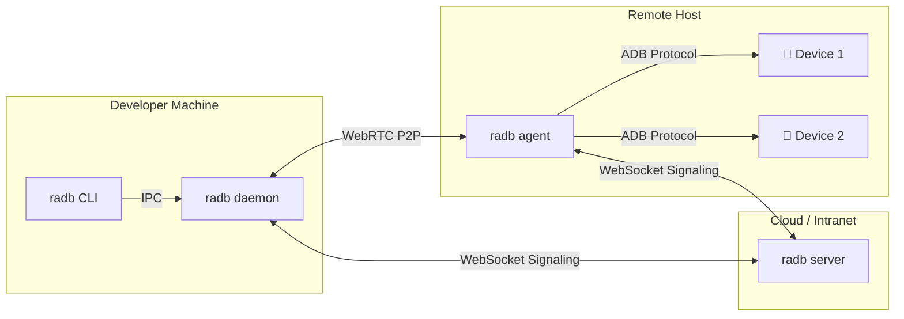

# radb -- Remote ADB P2P Forwarding Tool

[](README.md)

Forward Android devices from a remote host to your local machine via P2P network traversal. Use `adb shell`, `scrcpy` screen mirroring, and large file transfers as if the device were plugged in locally.

> **macOS users**: If you see "damaged" or "developer cannot be verified" on first launch, run `sudo xattr -dr com.apple.quarantine /Applications/radb.app`. [Details](#macos-first-run)
>
> **Windows users**: The standalone `.exe` is UPX-compressed and may trigger antivirus false positives. Use the `.zip` version instead if this happens. [Details](#pre-built-binaries)

---

## Key Features

- **P2P NAT/Firewall Traversal** -- no VPN or port forwarding required
- **Multi-device, Multi-user** -- one host manages multiple devices for multiple developers
- **DTLS Encryption** with token-based authentication
- **Single Binary Deployment** -- no dependencies to install
- **Interactive CLI** -- one-key device selection with automatic port allocation
- **Supports adb shell, scrcpy, large file transfers** (100MB+ stable)
- **Direct Mode** -- TCP direct connection over LAN/VPN, no Signal Server needed
- **mDNS Auto-Discovery** -- automatically find Agents on the local network
- **Manual SDP Pairing** -- NAT hole-punching without any server
- **GUI** -- double-click to open, no terminal needed (Gio, pure Go)

---

## Architecture



See [Architecture Docs](docs/architecture.md) for details.

---

## Requirements

| Requirement | Description |
|-------------|-------------|
| Go | >= 1.22 (build only) |
| ADB | Android Platform Tools on the Agent host |
| Network | Controller and Agent must be able to connect (via Server relay, LAN direct, or manual SDP pairing) |
| OS | Windows / Linux / macOS |

---

## Installation

### Build from Source

```bash
git clone https://github.com/chris1004tw/remote-adb.git
cd remote-adb
go build -trimpath -o radb ./cmd/radb
```

### go install

```bash
go install github.com/chris1004tw/remote-adb/cmd/radb@latest
```

### Pre-built Binaries

> Download from [GitHub Releases](https://github.com/chris1004tw/remote-adb/releases).

| Platform | Format | Description |
|----------|--------|-------------|
| macOS | `.dmg` (Universal Binary) | Supports both Intel and Apple Silicon. Drag radb.app to Applications |
| Linux | `.tar.gz` | Extract to get the `radb` binary |
| Windows | `.zip` | Extract to get `radb.exe` (uncompressed, clean PE structure) |
| Windows | `.exe` | Standalone executable (UPX-compressed, smaller size) |

> **Antivirus Note**: The standalone `.exe` is compressed with UPX to reduce file size. Some antivirus software may flag it due to heuristic detection. If this happens, use the `.zip` version instead -- the binary inside is not UPX-compressed and will not trigger false positives.

### macOS First Run

Since the binary is not signed by Apple, macOS will block the first launch. You may see one of the following messages:

- **"can't be opened because the developer cannot be verified"** (Gatekeeper block)
- **"is damaged and can't be opened. You should move it to the Trash"** (quarantine attribute)

Use either method below:

**Option 1: Remove quarantine attribute (recommended, also fixes the "damaged" error)**

```bash
sudo xattr -dr com.apple.quarantine /Applications/radb.app
```

**Option 2: Local code signing**

```bash
# Install Command Line Tools for Xcode (skip if already installed)
xcode-select --install

# Sign locally
sudo codesign --force --deep --sign - /Applications/radb.app
```

---

## Quick Start

**Step 1: Start the Server**

```bash
RADB_TOKEN=your-secret radb server --port 8080
```

**Step 2: Start the Agent on the remote host**

```bash
RADB_TOKEN=your-secret radb agent --server ws://your-server:8080 --host-id lab-pc-01
```

**Step 3: Start the local Daemon**

```bash
RADB_TOKEN=your-secret radb daemon --server ws://your-server:8080
```

**Step 4: Bind a device interactively**

```bash
radb bind
# Select host → Select device → Auto-assigned port
# Output: Bound DEVICE_SERIAL → localhost:15555
```

**Step 5: Use it like a local device**

```bash
adb -s localhost:15555 shell
scrcpy -s localhost:15555
adb -s localhost:15555 push large_file.apk /sdcard/
```

See [Configuration Guide](docs/configuration.md) for all options.

---

## Direct Mode (No Server Required)

### TCP Direct Connection (LAN/VPN)

```bash
# Agent: start direct mode
radb agent --direct-port 15555 --direct-token mysecret

# Can also connect to Signal Server simultaneously
radb agent --server ws://signal:8080 --token abc --direct-port 15555

# Client: auto-discover Agents on LAN (mDNS)
radb direct discover

# List devices
radb direct list 192.168.1.100:15555 --token mysecret

# Direct TCP connection (forward all devices, local ports starting from 5555)
radb direct connect 192.168.1.100:15555 --serial pixel-7 --token mysecret
# → ADB forwarded 127.0.0.1:5555 → pixel-7
```

---

## GUI Mode

Run `radb` without arguments to open the graphical interface with three tabs:

- **Easy Connect**: Cross-NAT manual SDP exchange (Client / Agent dual mode)
- **LAN Direct**: Start an Agent server or scan LAN for auto-discovery, one-click forwarding
- **Relay Server**: Connect via a central Signal Server
- **Settings** (gear icon, bottom-right): Manage ADB Port, Proxy Port, Direct Port, STUN Server, language switch. Supports manual update check. Settings are persisted in TOML at `%APPDATA%/radb/radb.toml` (Windows) or `~/.config/radb/radb.toml` (Linux/macOS)
- **Bilingual UI**: Traditional Chinese / English, auto-detected from system locale, switchable in settings (no restart needed)
- **Auto Update Check**: Checks for new versions on startup, shows a notification banner with "Update Now" or "Later" options

```bash
# GUI mode
radb

# Windows release build (hide console window)
go build -ldflags="-H windowsgui" ./cmd/radb
```

---

### Manual SDP Pairing (Cross-NAT Hole Punching)

For scenarios where you can't deploy a Server but need cross-network connectivity:

```bash
# Client: generate offer
radb pair offer --serial pixel-7
# → Copy the offer token to the Agent

# Agent: process offer
radb pair answer <offer-token>
# → Copy the answer token back to the Client

# Client pastes answer → connection established
# → ADB forwarded 127.0.0.1:15555 → pixel-7
```

---

## Quick scrcpy Setup (Windows)

If your environment requires `adb forward`, run:

```powershell
powershell -ExecutionPolicy Bypass -File scripts/windows/setup-scrcpy-radb.ps1
```

This writes `%APPDATA%\scrcpy\scrcpy.conf` with:

- `serial=127.0.0.1:15037`
- `force_adb_forward=true`

To also set `--no-audio` as default:

```powershell
powershell -ExecutionPolicy Bypass -File scripts/windows/setup-scrcpy-radb.ps1 -NoAudioDefault
```

Or use the launcher directly:

```cmd
scripts\windows\scrcpy-radb.cmd
```

---

## Configuration

| Environment Variable | Default | Description |
|---------------------|---------|-------------|
| `RADB_TOKEN` | (required) | PSK authentication token |
| `RADB_SERVER_URL` | `ws://localhost:8080` | Server URL |
| `RADB_STUN_URLS` | `stun:stun.l.google.com:19302` | STUN Server |
| `RADB_TURN_URL` | (empty) | TURN Server (needed for symmetric NAT) |
| `RADB_DIRECT_PORT` | (empty) | Agent Direct TCP listen port |
| `RADB_DIRECT_TOKEN` | (empty) | Direct connection token |
| `RADB_PORT_START` | `5555` | Client starting port |

See [Configuration Guide](docs/configuration.md) for the full reference.

---

## Project Structure

```
remote-adb/
├── cmd/
│   └── radb/              # Unified entry point (server/agent/daemon/bind/direct/pair/gui/update)
├── internal/
│   ├── adb/               # ADB protocol, device management, auto-download platform-tools
│   ├── agent/             # Remote agent core logic
│   ├── buildinfo/         # Build-time version info (Version/Commit/Date)
│   ├── cli/               # bubbletea interactive bind menu
│   ├── daemon/            # Background service, port allocation, binding table, IPC
│   ├── directsrv/         # TCP direct connection service + mDNS broadcast
│   ├── gui/               # Gio GUI (settings panel + ADB transport + forward interception + i18n)
│   ├── proxy/             # TCP proxy (16KB chunking, single-connection replacement)
│   ├── signal/            # WebSocket signaling hub, PSK auth
│   ├── updater/           # Auto-update (GitHub Releases download + cross-platform binary replacement)
│   └── webrtc/            # PeerConnection and DataChannel management (detach mode)
├── pkg/protocol/          # Shared signaling JSON format (Envelope + Payload types)
├── assets/                # Cross-platform resources (app SVG icon)
├── macos/                 # macOS .app bundle metadata (Info.plist)
├── configs/               # Configuration examples
├── docs/                  # Design documents
├── scripts/               # Platform helper scripts (build-dmg.sh, scrcpy setup)
├── test/e2e/              # End-to-end integration tests
├── go.mod
└── README.md
```

---

## Development

```bash
# Build
go build -trimpath -o radb ./cmd/radb

# Test
go test ./...

# Lint
golangci-lint run
```

See [Development Guide](docs/development.md) for details.

---

## Documentation

| Document | Description |
|----------|-------------|
| [Architecture](docs/architecture.md) | System architecture, signaling protocol, tech stack |
| [Agent Design](docs/agent-design.md) | Remote agent device management and forwarding |
| [Client Design](docs/client-design.md) | Local daemon, CLI, TCP proxy design |
| [Configuration](docs/configuration.md) | Full environment variable and CLI flag reference |
| [Development](docs/development.md) | Build, test, code conventions |
| [coturn Setup](docs/coturn-setup.md) | TURN Server installation, configuration, and integration |

---

## FAQ

**Q: Can't connect to the remote device?**
A: Check that the Server is reachable, tokens match, and firewalls aren't blocking WebRTC traffic. If behind symmetric NAT, configure a TURN Server.

**Q: Device shows as offline?**
A: Ensure the ADB server is running on the remote host (`adb start-server`) and the device has authorized USB debugging.

**Q: Port already in use?**
A: Use `--port-start` to specify a different starting port, or run `radb list` to see occupied ports.

**Q: Large file transfer interrupted?**
A: If using TURN relay, check the TURN server's bandwidth limits. Use STUN direct connection (P2P) when possible.

---

## License

MIT License -- see [LICENSE](LICENSE)
