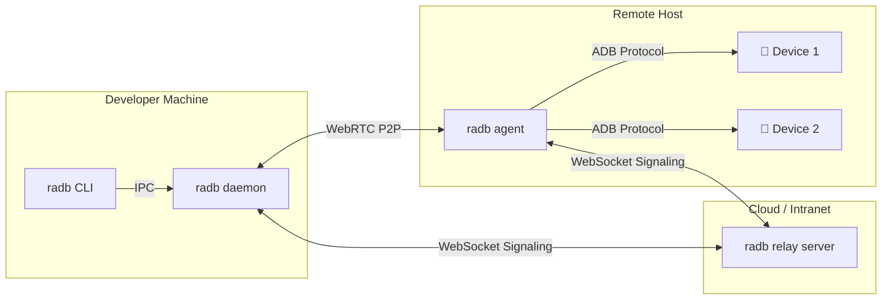

# radb -- Remote ADB P2P Forwarding Tool

[繁體中文版](README.md)

Forward Android devices from a remote host to your local machine via P2P network traversal. Use `adb shell`, `scrcpy` screen mirroring, and large file transfers as if the device were plugged in locally.

> **macOS users**: If you see "damaged" or "developer cannot be verified" on first launch, run `sudo xattr -dr com.apple.quarantine /Applications/radb.app`. [Details](#macos-first-run)
>
> **Windows users**: The standalone `.exe` is UPX-compressed and may trigger antivirus false positives. Use the `.zip` version instead if this happens. [Details](#pre-built-binaries)

---

## Key Features

- **P2P NAT/Firewall Traversal** -- no VPN or port forwarding required
- **Three Connection Modes**: P2P direct / LAN TCP direct / Relay Server
- **Multi-device, Multi-user** -- each device gets its own port, supports multiple developers
- **DTLS Encryption** with token-based authentication
- **Single Binary Deployment** -- no dependencies to install
- **CLI + GUI** -- one-key device selection with automatic port allocation
- **Supports adb shell, scrcpy, large file transfers** (100MB+ stable)

---

## Architecture



See [Architecture Docs](docs/architecture.md) for details.

---

## Requirements

| Requirement | Description |
|-------------|-------------|
| Go | >= 1.22 (build only) |
| ADB | Android Platform Tools on the Agent host |
| Network | Controller and Agent must be able to connect (via Server relay, LAN direct, or manual SDP pairing) |
| OS | Windows / Linux / macOS |

---

## Installation

### Build from Source

```bash
git clone https://github.com/chris1004tw/remote-adb.git
cd remote-adb
go build -trimpath -o radb ./cmd/radb
```

### go install

```bash
go install github.com/chris1004tw/remote-adb/cmd/radb@latest
```

### Pre-built Binaries

> Download from [GitHub Releases](https://github.com/chris1004tw/remote-adb/releases).

| Platform | Format | Description |
|----------|--------|-------------|
| macOS | `.dmg` (Universal Binary) | Supports both Intel and Apple Silicon. Drag radb.app to Applications |
| Linux | `.tar.gz` | Extract to get the `radb` binary |
| Windows | `.zip` | Extract to get `radb.exe` (uncompressed, clean PE structure) |
| Windows | `.exe` | Standalone executable (UPX-compressed, smaller size) |

> **Antivirus Note**: The standalone `.exe` is compressed with UPX to reduce file size. Some antivirus software may flag it due to heuristic detection. If this happens, use the `.zip` version instead -- the binary inside is not UPX-compressed and will not trigger false positives.

### macOS First Run

Since the binary is not signed by Apple, macOS will block the first launch. You may see one of the following messages:

- **"can't be opened because the developer cannot be verified"** (Gatekeeper block)
- **"is damaged and can't be opened. You should move it to the Trash"** (quarantine attribute)

Use either method below:

**Option 1: Remove quarantine attribute (recommended, also fixes the "damaged" error)**

```bash
sudo xattr -dr com.apple.quarantine /Applications/radb.app
```

**Option 2: Local code signing**

```bash
# Install Command Line Tools for Xcode (skip if already installed)
xcode-select --install

# Sign locally
sudo codesign --force --deep --sign - /Applications/radb.app
```

---

## Usage

radb offers three connection modes, all supported in both CLI and GUI:

| Mode | Use Case | Server Required |
|------|----------|-----------------|
| **P2P** | Cross-NAT, one-to-one quick pairing | No (uses free Cloudflare TURN by default) |
| **Direct** | Same LAN / VPN | No |
| **Relay** | Multi-user, multi-device, long-term deployment | Yes (self-hosted Relay Server) |

### P2P Mode (Cross-NAT, No Server Required)

Establish a P2P connection via WebRTC by exchanging offer/answer tokens:

```bash
# Client: generate offer
radb p2p connect
# → Copy the offer token to the Agent, then wait for the answer token
# → Retry on invalid input (offer is one-time-use, won't be wasted by accidental Enter)

# Agent: process offer and return answer
radb p2p agent <offer-token>
# → Copy the answer token back to the Client

# Client pastes answer → P2P connection established
# → Each device gets its own port (starting from 5555), auto adb connect

# Uses Cloudflare free TURN by default, switch with --turn-mode:
radb p2p connect --turn-mode none      # STUN only, no TURN
radb p2p connect --turn-mode custom    # Use custom TURN server
```

### Direct Mode (LAN Direct, No Server Required)

For same LAN or VPN scenarios:

```bash
# Agent: start listening on LAN
radb direct agent --port 9000 --token mysecret

# Client: auto-discover Agents on LAN (mDNS)
radb direct discover

# List devices
radb direct connect 192.168.1.100:9000 --list --token mysecret

# TCP direct connection (per-device proxy ports, supports adb shell / scrcpy / forward)
radb direct connect 192.168.1.100:9000 --token mysecret
# → Each device gets its own port (starting from 5555), auto adb connect
```

### Relay Mode (Via Relay Server)

For multi-user, multi-device team environments:

**Step 1: Start the Relay Server**

```bash
RADB_TOKEN=your-secret radb relay server --port 8080
```

**Step 2: Start the Agent on the remote host**

```bash
RADB_TOKEN=your-secret radb relay agent --server ws://your-server:8080 --host-id lab-pc-01
```

**Step 3: Start the local Daemon**

```bash
RADB_TOKEN=your-secret radb relay daemon --server ws://your-server:8080
```

**Step 4: Bind a device interactively**

```bash
radb relay bind
# Select host → Select device → Auto-assigned port
# Output: Bound DEVICE_SERIAL → localhost:15555
```

**Step 5: Use it like a local device**

```bash
adb -s localhost:15555 shell
scrcpy -s localhost:15555
adb -s localhost:15555 push large_file.apk /sdcard/
```

See [Configuration Guide](docs/configuration.md) for all options.

---

## GUI

Run `radb` without arguments to open the graphical interface.

```bash
radb
```

### Tabs

| Tab | Function | CLI Equivalent |
|-----|----------|---------------|
| **Easy Connect** | Cross-NAT manual SDP exchange (Client / Agent dual mode) | `radb p2p` |
| **LAN Direct** | Start Agent server or scan LAN for auto-discovery | `radb direct` |
| **Relay Server** | Connect via a central Relay Server | `radb relay` |

### Features

- **Per-device Proxy Port**: Each remote device gets its own port (starting from 5555), so `scrcpy` / UIAutomator can target a specific device via `adb -s 127.0.0.1:<port>`
- **Re-add Remote ADB Devices**: One-click `adb connect` button on the P2P client page -- no need to rebuild the P2P connection when tools like Scrcpy GUI accidentally disconnect ADB
- **Quick Offer**: "Generate offer now" button for faster ICE gathering (may lack some candidates)
- **Offer Pre-generation**: Automatically pre-generates offer in the background when entering client mode, ready instantly on click
- **Connection Progress**: Multi-stage progress display (Preparing TURN → Creating components → Gathering candidates → Encoding)
- **Bilingual UI**: Traditional Chinese / English, auto-detected from system locale, switchable instantly (no restart)
- **Auto Update**: Checks for new versions on startup, shows notification banner

### Settings Panel

Click the gear icon (bottom-right) to manage:

- ADB Port, Proxy Port, Direct Port
- STUN Server
- TURN mode (Cloudflare free / custom URL + credentials)
- Language switch, manual update check

TURN defaults to free Cloudflare credentials (auto-fetched, works out of the box). Settings are persisted in TOML at `%APPDATA%/radb/radb.toml` (Windows) or `~/.config/radb/radb.toml` (Linux/macOS).

---

## Configuration

| Environment Variable | Default | Description |
|---------------------|---------|-------------|
| `RADB_TOKEN` | (required) | PSK authentication token |
| `RADB_SERVER_URL` | `ws://localhost:8080` | Server URL |
| `RADB_STUN_URLS` | `stun:stun.l.google.com:19302` | STUN Server |
| `RADB_TURN_MODE` | `cloudflare` | TURN mode (`cloudflare` / `custom` / `none`) |
| `RADB_TURN_URL` | (empty) | Custom TURN Server URL (used with `--turn-mode custom`) |
| `RADB_DIRECT_PORT` | (empty) | Agent Direct TCP listen port |
| `RADB_DIRECT_TOKEN` | (empty) | Direct connection token |
| `RADB_PORT_START` | `5555` | Client starting port |

See [Configuration Guide](docs/configuration.md) for the full reference.

---

## Project Structure

```
remote-adb/
├── cmd/
│   └── radb/              # Unified entry point (p2p/direct/relay modules + update/version + GUI)
├── internal/
│   ├── adb/               # ADB protocol, device management, auto-download platform-tools
│   ├── agent/             # Remote agent core logic
│   ├── buildinfo/         # Build-time version info (Version/Commit/Date)
│   ├── cli/               # bubbletea interactive bind menu
│   ├── daemon/            # Background service, port allocation, binding table, IPC
│   ├── bridge/            # Shared GUI/CLI logic (SDP codec, ADB transport, forward management)
│   ├── directsrv/         # TCP direct connection service + mDNS broadcast + client connection
│   ├── gui/               # Gio GUI (Easy Connect/LAN Direct/Relay tabs + settings + i18n + Cloudflare TURN + TURN prefetch cache)
│   ├── proxy/             # TCP proxy (16KB chunking, single-connection replacement)
│   ├── signal/            # WebSocket signaling hub, PSK auth
│   ├── updater/           # Auto-update (GitHub Releases download + cross-platform binary replacement)
│   └── webrtc/            # PeerConnection and DataChannel management (detach mode + relay detection + Cloudflare TURN)
├── pkg/protocol/          # Shared signaling JSON format (Envelope + Payload types)
├── assets/                # Cross-platform resources (app SVG icon)
├── macos/                 # macOS .app bundle metadata (Info.plist)
├── configs/               # Configuration examples
├── docs/                  # Design documents
├── scripts/               # Platform helper scripts (build-dmg.sh, scrcpy setup)
├── test/e2e/              # End-to-end integration tests
├── go.mod
└── README.md
```

---

## Development

```bash
# Build
go build -trimpath -o radb ./cmd/radb

# Test
go test ./...

# Lint
golangci-lint run
```

See [Development Guide](docs/development.md) for details.

---

## Documentation

| Document | Description |
|----------|-------------|
| [Architecture](docs/architecture.md) | System architecture, signaling protocol, tech stack |
| [Agent Design](docs/agent-design.md) | Remote agent device management and forwarding |
| [Client Design](docs/client-design.md) | Local daemon, CLI, TCP proxy design |
| [Configuration](docs/configuration.md) | Full environment variable and CLI flag reference |
| [Development](docs/development.md) | Build, test, code conventions |
| [coturn Setup](docs/coturn-setup.md) | TURN Server installation, configuration, and integration |

---

## FAQ

**Q: Can't connect to the remote device?**
A: Check that the Server is reachable, tokens match, and firewalls aren't blocking WebRTC traffic. If behind symmetric NAT, configure a TURN Server (GUI defaults to Cloudflare free TURN, usually no extra setup needed).

**Q: Device shows as offline?**
A: Ensure the ADB server is running on the remote host (`adb start-server`) and the device has authorized USB debugging.

**Q: Port already in use?**
A: Use `--port-start` to specify a different starting port, or run `radb relay list` to see occupied ports.

**Q: Large file transfer interrupted?**
A: If using TURN relay, check the TURN server's bandwidth limits. Use STUN direct connection (P2P) when possible.

---

## License

MIT License -- see [LICENSE](LICENSE)
