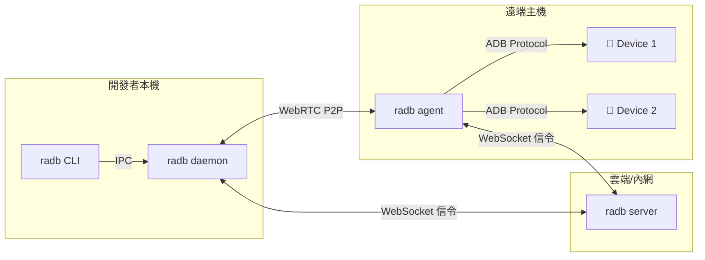

# radb -- 遠端 ADB P2P 轉發工具

透過 P2P 網路穿透，讓你在本機像操作本地 USB 設備一樣，使用遠端主機上的 Android 手機。支援 `adb shell`、`scrcpy` 投影與大檔案傳輸。

---

## 核心特色

- **P2P 穿透 NAT/防火牆**，無需 VPN 或 Port Forwarding
- **單一主機管理多支設備**，支援多開發者同時使用
- **DTLS 全程加密**，Token 身分驗證
- **單一執行檔部署**，免安裝相依套件
- **互動式 CLI**，一鍵選機、自動分配 Port
- **支援 adb shell、scrcpy、大檔案傳輸**（100MB+ 穩定）
- **Direct 模式**：LAN/VPN 內 TCP 直連，不需要 Signal Server
- **mDNS 自動發現**：自動找到區域網路內的 Agent
- **手動 SDP 配對**：跨 NAT 打洞，不需要任何 Server
- **GUI 介面**：雙擊即開，免開 Terminal（Gio 純 Go 實作）

---

## 架構簡圖



詳細架構設計請參閱 [系統架構文件](docs/architecture.md)。

---

## 環境需求

| 需求項目 | 說明 |
|---------|------|
| Go | >= 1.22（僅建置時需要） |
| ADB | Agent 所在主機需安裝 Android Platform Tools |
| 網路 | Agent 與 Client 需可連線至 Server |
| 作業系統 | Windows / Linux / macOS |

---

## 安裝方式

### 從原始碼建置

```bash
git clone https://github.com/chris1004tw/remote-adb.git
cd remote-adb
go build -o radb ./cmd/radb
```

### go install

```bash
go install github.com/chris1004tw/remote-adb/cmd/radb@latest
```

### 預編譯 Binary

> 前往 [GitHub Releases](https://github.com/chris1004tw/remote-adb/releases) 下載對應平台的執行檔。

---

## 快速開始

**步驟 1：啟動 Server**

```bash
RADB_TOKEN=your-secret radb server --port 8080
```

**步驟 2：在遠端主機啟動 Agent**

```bash
RADB_TOKEN=your-secret radb agent --server ws://your-server:8080 --host-id lab-pc-01
```

**步驟 3：啟動本機 Daemon**

```bash
RADB_TOKEN=your-secret radb daemon --server ws://your-server:8080
```

**步驟 4：互動式綁定設備**

```bash
radb bind
# 選擇主機 → 選擇設備 → 自動分配 Port
# 輸出：已綁定 DEVICE_SERIAL → localhost:15555
```

**步驟 5：像本地設備一樣使用**

```bash
adb -s localhost:15555 shell
scrcpy -s localhost:15555
adb -s localhost:15555 push large_file.apk /sdcard/
```

完整設定參數請參閱 [設定指南](docs/configuration.md)。

---

## Direct 模式（無需 Server）

### TCP 直連（LAN/VPN 場景）

```bash
# Agent 端：啟動 direct 模式
radb agent --direct-port 7070 --direct-token mysecret

# 也可同時連線 Signal Server
radb agent --server ws://signal:8080 --token abc --direct-port 7070

# Client 端：自動發現 LAN 上的 Agent（mDNS）
radb direct discover

# 查詢設備
radb direct list 192.168.1.100:7070 --token mysecret

# TCP 直連
radb direct connect 192.168.1.100:7070 --serial pixel-7 --token mysecret
# → ADB 轉發 127.0.0.1:15555 → pixel-7
```

---

## GUI 模式

直接執行 `radb`（不帶引數）即可開啟圖形介面，包含三個分頁：

- **Agent**：啟動 Direct 模式 Agent，追蹤 ADB 設備
- **Direct Connect**：掃描 LAN / 手動輸入地址，連線遠端設備
- **SDP 配對**：跨 NAT 手動 SDP 交換（Client / Agent 雙模式）

```bash
# GUI 模式
radb

# Windows release 建置（隱藏主控台視窗）
go build -ldflags="-H windowsgui" ./cmd/radb
```

---

### 手動 SDP 配對（跨 NAT 打洞）

適用於無法部署 Server、但需要跨網路連線的場景：

```bash
# Client 端：生成 offer
radb pair offer --serial pixel-7
# → 複製 offer token 給 Agent 端

# Agent 端：處理 offer
radb pair answer <offer-token>
# → 複製 answer token 回 Client 端

# Client 貼上 answer → 連線建立
# → ADB 轉發 127.0.0.1:15555 → pixel-7
```

---

## 設定說明

| 環境變數 | 預設值 | 說明 |
|---------|--------|------|
| `RADB_TOKEN` | (必填) | PSK 驗證 Token |
| `RADB_SERVER_URL` | `ws://localhost:8080` | Server 位址 |
| `RADB_STUN_URLS` | `stun:stun.l.google.com:19302` | STUN Server |
| `RADB_TURN_URL` | (空) | TURN Server（對稱型 NAT 需要） |
| `RADB_DIRECT_PORT` | (空) | Agent Direct TCP 監聽埠 |
| `RADB_DIRECT_TOKEN` | (空) | Direct 連線 Token |
| `RADB_PORT_START` | `15555` | Client 起始 Port |

完整設定請參閱 [設定指南](docs/configuration.md)。

---

## 專案目錄結構

```
remote-adb/
├── cmd/
│   └── radb/              # 統一入口（server/agent/daemon/bind/...）
├── internal/
│   ├── agent/             # 遠端代理端核心邏輯
│   ├── adb/               # ADB 協定與設備管理
│   ├── cli/               # 互動式選單
│   ├── daemon/            # 背景服務與 Port 管理
│   ├── directsrv/         # TCP 直連服務 + mDNS 廣播
│   ├── gui/               # Gio GUI 介面
│   ├── proxy/             # TCP 代理
│   ├── signal/            # WebSocket 信令
│   └── webrtc/            # P2P 通道管理
├── pkg/protocol/          # 共用格式定義
├── configs/               # 設定檔範例
├── docs/                  # 詳細文件
├── go.mod
└── README.md
```

---

## 開發指南

```bash
# 建置
go build -o radb ./cmd/radb

# 測試
go test ./...

# Lint
golangci-lint run
```

詳細請參閱 [開發者指南](docs/development.md)。

---

## 文件連結

| 文件 | 說明 |
|------|------|
| [系統架構](docs/architecture.md) | 三元件架構、信令協定、技術選型 |
| [Agent 設計](docs/agent-design.md) | 遠端被控端的設備管理與轉發機制 |
| [Client 設計](docs/client-design.md) | 本機端 Daemon、CLI、TCP 代理設計 |
| [設定指南](docs/configuration.md) | 完整環境變數與 CLI flag 參數表 |
| [開發者指南](docs/development.md) | 建置、測試、程式碼規範 |
| [coturn 架設指南](docs/coturn-setup.md) | TURN Server 安裝、設定與整合 |

---

## FAQ

**Q: 連線不上遠端設備？**
A: 檢查 Server 是否可達、Token 是否一致、防火牆是否阻擋 WebRTC 流量。若在對稱型 NAT 後方，需設定 TURN Server。

**Q: 設備顯示 offline？**
A: 確認遠端主機的 ADB server 正在運行（`adb start-server`），且設備已授權 USB 偵錯。

**Q: Port 被占用？**
A: 使用 `--port-start` 指定不同起始 Port，或用 `radb list` 查看已占用的 Port。

**Q: 大檔案傳輸中斷？**
A: 若使用 TURN 中繼，檢查 TURN server 的頻寬限制。建議在可行時使用 STUN 直連（P2P）。

---

## License

MIT License -- 詳見 [LICENSE](LICENSE)
