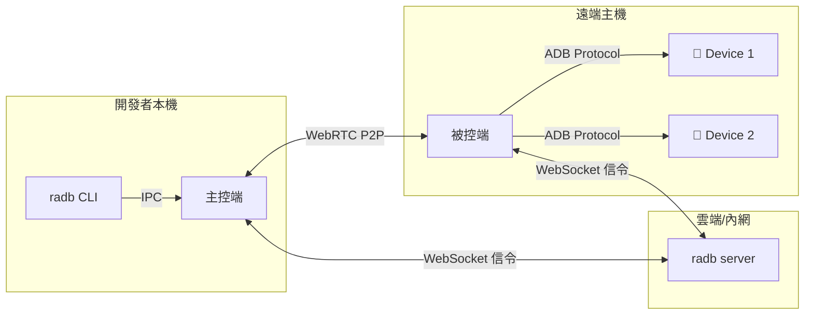

# radb -- 遠端 ADB P2P 轉發工具

[](README.en.md)

透過 P2P 網路穿透，讓你在本機像操作本地 USB 設備一樣，使用遠端主機上的 Android 手機。支援 `adb shell`、`scrcpy` 投影與大檔案傳輸。

> **macOS 使用者**：首次開啟若出現「已損毀」或「無法驗證開發者」提示，請執行 `sudo xattr -dr com.apple.quarantine /Applications/radb.app` 即可解決。[詳細說明](#macos-首次執行)
>
> **Windows 使用者**：獨立 `.exe` 經 UPX 壓縮，部分防毒軟體可能誤報。若遇此情況請改用 `.zip` 版本。[詳細說明](#預編譯-binary)

---

## 核心特色

- **P2P 穿透 NAT/防火牆**，無需 VPN 或 Port Forwarding
- **單一主機管理多支設備**，支援多開發者同時使用
- **DTLS 全程加密**，Token 身分驗證
- **單一執行檔部署**，免安裝相依套件
- **互動式 CLI**，一鍵選機、自動分配 Port
- **支援 adb shell、scrcpy、大檔案傳輸**（100MB+ 穩定）
- **Direct 模式**：LAN/VPN 內 TCP 直連，不需要 Signal Server
- **mDNS 自動發現**：自動找到區域網路內的被控端
- **手動 SDP 配對**：跨 NAT 打洞，不需要任何 Server
- **GUI 介面**：雙擊即開，免開 Terminal（Gio 純 Go 實作）

---

## 架構簡圖



詳細架構設計請參閱 [系統架構文件](docs/architecture.md)。

---

## 環境需求

| 需求項目 | 說明 |
|---------|------|
| Go | >= 1.22（僅建置時需要） |
| ADB | 被控端所在主機需安裝 Android Platform Tools |
| 網路 | 主控端與被控端需能互相連線（可透過 Server 中繼、LAN 直連或 SDP 手動配對） |
| 作業系統 | Windows / Linux / macOS |

---

## 安裝方式

### 從原始碼建置

```bash
git clone https://github.com/chris1004tw/remote-adb.git
cd remote-adb
go build -trimpath -o radb ./cmd/radb
```

### go install

```bash
go install github.com/chris1004tw/remote-adb/cmd/radb@latest
```

### 預編譯 Binary

> 前往 [GitHub Releases](https://github.com/chris1004tw/remote-adb/releases) 下載對應平台的檔案。

| 平台 | 格式 | 說明 |
|------|------|------|
| macOS | `.dmg`（Universal Binary） | 同時支援 Intel 與 Apple Silicon，開啟後將 radb.app 拖入 Applications |
| Linux | `.tar.gz` | 解壓後取得 `radb` 執行檔 |
| Windows | `.zip` | 解壓後取得 `radb.exe`（未壓縮，PE 結構完整） |
| Windows | `.exe` | 獨立執行檔（UPX 壓縮，體積較小） |

> **防毒軟體提示**：獨立 `.exe` 經 UPX 壓縮以縮小體積，部分防毒軟體可能因啟發式偵測產生誤報。若遇到此情況，請改用 `.zip` 版本，其中的 binary 未經 UPX 壓縮，不會觸發誤判。

### macOS 首次執行

由於未經 Apple 簽名，macOS 會阻擋首次執行，可能出現以下提示：

- **「無法打開，因為無法驗證開發者」**（Gatekeeper 攔截）
- **「已損毀，無法打開。您應該將其丟到垃圾桶」**（隔離屬性標記）

請依以下**任一方式**解除：

**方式一：移除隔離屬性（推薦，可同時解決「已損毀」提示）**

```bash
sudo xattr -dr com.apple.quarantine /Applications/radb.app
```

**方式二：本地簽名**

```bash
# 安裝 Command Line Tools for Xcode（若已安裝可跳過）
xcode-select --install

# 本地簽名
sudo codesign --force --deep --sign - /Applications/radb.app
```

---

## 快速開始

**步驟 1：啟動 Server**

```bash
RADB_TOKEN=your-secret radb server --port 8080
```

**步驟 2：在遠端主機啟動被控端**

```bash
RADB_TOKEN=your-secret radb agent --server ws://your-server:8080 --host-id lab-pc-01
```

**步驟 3：啟動本機 Daemon**

```bash
RADB_TOKEN=your-secret radb daemon --server ws://your-server:8080
```

**步驟 4：互動式綁定設備**

```bash
radb bind
# 選擇主機 → 選擇設備 → 自動分配 Port
# 輸出：已綁定 DEVICE_SERIAL → localhost:15555
```

**步驟 5：像本地設備一樣使用**

```bash
adb -s localhost:15555 shell
scrcpy -s localhost:15555
adb -s localhost:15555 push large_file.apk /sdcard/
```

完整設定參數請參閱 [設定指南](docs/configuration.md)。

---

## Direct 模式（無需 Server）

### TCP 直連（LAN/VPN 場景）

```bash
# 被控端：啟動 direct 模式
radb agent --direct-port 15555 --direct-token mysecret

# 也可同時連線 Signal Server
radb agent --server ws://signal:8080 --token abc --direct-port 15555

# 主控端：自動發現 LAN 上的被控端（mDNS）
radb discover

# 查詢設備
radb connect 192.168.1.100:15555 --list --token mysecret

# TCP 直連（全設備多工轉發，支援 adb shell / scrcpy / forward）
radb connect 192.168.1.100:15555 --token mysecret
# → ADB proxy 127.0.0.1:15037，自動 adb connect
```

---

## GUI 模式

直接執行 `radb`（不帶引數）即可開啟圖形介面，包含三個分頁：

- **簡易連線**：跨 NAT 手動 SDP 交換（主控端 / 被控端雙模式）
- **區網直連**：開啟被控端伺服器或掃描 LAN 自動發現，一鍵轉發全部設備
- **Relay 伺服器**：透過中央 Signal Server 連線
- **設定面板**（右下角齒輪）：集中管理 ADB Port、Proxy Port、Direct Port、STUN Server、TURN 模式（Cloudflare 免費 / 自訂）、語言切換，支援手動檢查更新。TURN 預設使用 Cloudflare 免費 TURN 憑證（自動取得，開箱即用）；選擇自訂模式時顯示 URL/帳號/密碼輸入框。設定以 TOML 格式持久化於 `%APPDATA%/radb/radb.toml`（Windows）或 `~/.config/radb/radb.toml`（Linux/macOS）
- **多語系支援**：繁體中文 / English 雙語介面，預設根據系統語系自動偵測，可在設定面板即時切換（不需重啟）
- **啟動自動檢查更新**：程式啟動後背景檢查新版本，有更新時在主畫面底部顯示通知橫幅，使用者可選擇「立即更新」或「稍後再說」
- GUI/CLI 共用 ADB bridge（`internal/bridge/`）針對 DataChannel 採用 **16KB 分塊傳輸**，提升 `scrcpy` 視訊與大流量穩定性
- 內建 forward 攔截會將本機 `adb connect` 序號（如 `127.0.0.1:15037`）映射為遠端真實設備序號，避免 `scrcpy` forward 失配
- ADB transport 的 host→device `WRTE` 路徑同樣採 **16KB 分塊寫入**，避免 `sync`/`scrcpy` 啟動階段的大封包失敗

```bash
# GUI 模式
radb

# Windows release 建置（隱藏主控台視窗）
go build -ldflags="-H windowsgui" ./cmd/radb
```

---

### 手動 SDP 配對（跨 NAT 打洞）

適用於無法部署 Server、但需要跨網路連線的場景：

```bash
# 主控端：生成邀請碼（compact SDP token）
radb connect pair
# → 複製邀請碼給被控端，等待輸入回應碼

# 被控端：處理邀請碼並回傳回應碼
radb agent pair <邀請碼>
# → 複製回應碼回主控端

# 主控端貼上回應碼 → P2P 連線建立
# → ADB proxy 127.0.0.1:15037，全設備多工轉發
```

---

## 新電腦快速設定（scrcpy）

如果你的環境必須強制走 adb forward，避免每次手打參數，可執行：

```powershell
powershell -ExecutionPolicy Bypass -File scripts/windows/setup-scrcpy-radb.ps1
```

此腳本會寫入 `%APPDATA%\scrcpy\scrcpy.conf`，預設包含：

- `serial=127.0.0.1:15037`
- `force_adb_forward=true`

若你也要把 `--no-audio` 設成預設：

```powershell
powershell -ExecutionPolicy Bypass -File scripts/windows/setup-scrcpy-radb.ps1 -NoAudioDefault
```

你也可以直接用啟動器：

```cmd
scripts\windows\scrcpy-radb.cmd
```

若要改目標 serial，可先設定環境變數：

```cmd
set RADB_SERIAL=127.0.0.1:15037
scripts\windows\scrcpy-radb.cmd
```

---

## 設定說明

| 環境變數 | 預設值 | 說明 |
|---------|--------|------|
| `RADB_TOKEN` | (必填) | PSK 驗證 Token |
| `RADB_SERVER_URL` | `ws://localhost:8080` | Server 位址 |
| `RADB_STUN_URLS` | `stun:stun.l.google.com:19302` | STUN Server |
| `RADB_TURN_URL` | (空) | TURN Server（對稱型 NAT 需要；GUI 預設使用 Cloudflare 免費 TURN） |
| `RADB_DIRECT_PORT` | (空) | 被控端 Direct TCP 監聽埠 |
| `RADB_DIRECT_TOKEN` | (空) | Direct 連線 Token |
| `RADB_PORT_START` | `5555` | 主控端起始 Port |

完整設定請參閱 [設定指南](docs/configuration.md)。

---

## 專案目錄結構

```
remote-adb/
├── cmd/
│   └── radb/              # 統一入口（server/agent/daemon/bind/connect/discover/gui/update）
├── internal/
│   ├── adb/               # ADB 協定、設備管理、自動下載 platform-tools
│   ├── agent/             # 遠端代理端核心邏輯
│   ├── buildinfo/         # 編譯時注入的版本資訊（Version/Commit/Date）
│   ├── cli/               # bubbletea 互動式 bind 選單
│   ├── daemon/            # 背景服務、Port 分配、Binding Table、IPC
│   ├── bridge/            # GUI/CLI 共用邏輯（SDP 編解碼、ADB transport、forward 管理）
│   ├── directsrv/         # TCP 直連服務 + mDNS 廣播 + 客戶端連線
│   ├── gui/               # Gio GUI 介面（設定面板 + i18n 多語系 + Cloudflare TURN）
│   ├── proxy/             # TCP 代理（16KB chunking、單連線替換設計）
│   ├── signal/            # WebSocket 信令 hub、PSK 認證
│   ├── updater/           # 自動更新（GitHub Releases 下載 + 跨平台 binary 替換）
│   └── webrtc/            # PeerConnection 與 DataChannel 管理（detach 模式 + relay 偵測）
├── pkg/protocol/          # 共用信令 JSON 格式（Envelope + Payload types）
├── assets/                # 跨平台共用資源（應用程式 SVG 圖示）
├── macos/                 # macOS .app bundle metadata（Info.plist）
├── configs/               # 設定檔範例
├── docs/                  # 詳細設計文件
├── scripts/               # 平台輔助腳本（build-dmg.sh、scrcpy 快速設定）
├── test/e2e/              # 端對端整合測試
├── go.mod
└── README.md
```

---

## 開發指南

```bash
# 建置
go build -trimpath -o radb ./cmd/radb

# 測試
go test ./...

# Lint
golangci-lint run
```

詳細請參閱 [開發者指南](docs/development.md)。

---

## 文件連結

| 文件 | 說明 |
|------|------|
| [系統架構](docs/architecture.md) | 三元件架構、信令協定、技術選型 |
| [被控端設計](docs/agent-design.md) | 遠端被控端的設備管理與轉發機制 |
| [主控端設計](docs/client-design.md) | 本機端 Daemon、CLI、TCP 代理設計 |
| [設定指南](docs/configuration.md) | 完整環境變數與 CLI flag 參數表 |
| [開發者指南](docs/development.md) | 建置、測試、程式碼規範 |
| [coturn 架設指南](docs/coturn-setup.md) | TURN Server 安裝、設定與整合 |

---

## FAQ

**Q: 連線不上遠端設備？**
A: 檢查 Server 是否可達、Token 是否一致、防火牆是否阻擋 WebRTC 流量。若在對稱型 NAT 後方，需設定 TURN Server（GUI 預設已啟用 Cloudflare 免費 TURN，通常不需額外設定）。

**Q: 設備顯示 offline？**
A: 確認遠端主機的 ADB server 正在運行（`adb start-server`），且設備已授權 USB 偵錯。

**Q: Port 被占用？**
A: 使用 `--port-start` 指定不同起始 Port，或用 `radb list` 查看已占用的 Port。

**Q: 大檔案傳輸中斷？**
A: 若使用 TURN 中繼，檢查 TURN server 的頻寬限制。建議在可行時使用 STUN 直連（P2P）。

---

## License

MIT License -- 詳見 [LICENSE](LICENSE)
